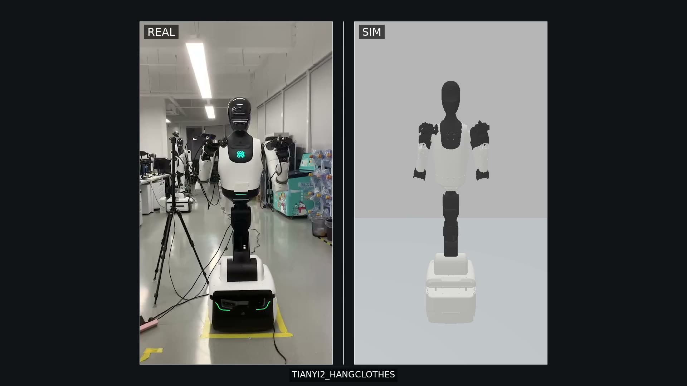
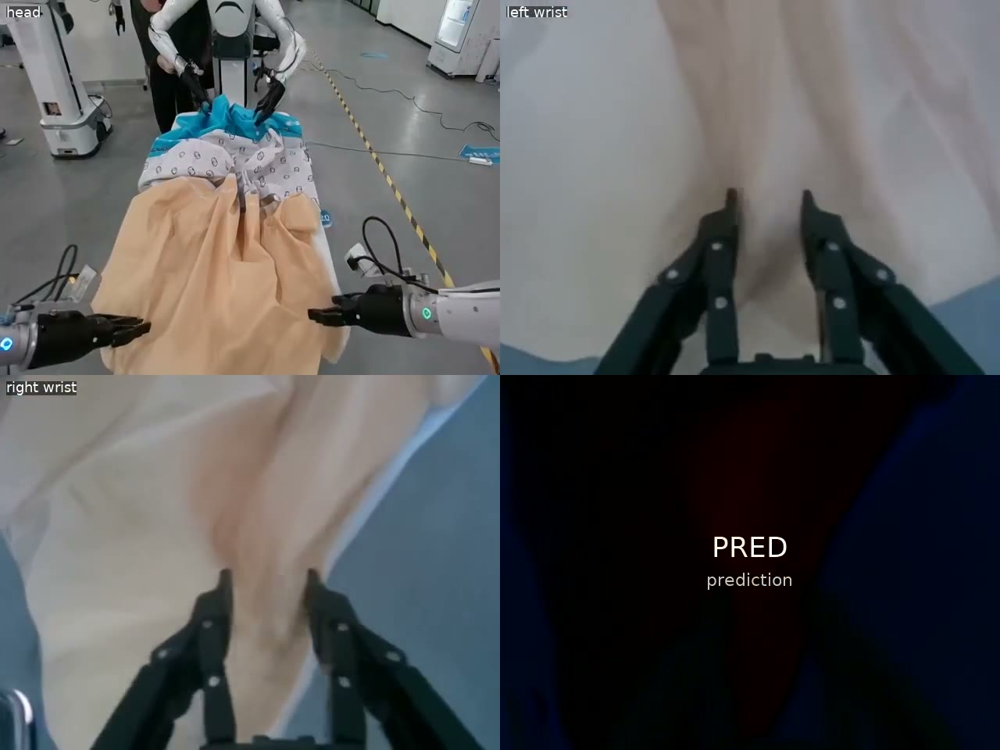
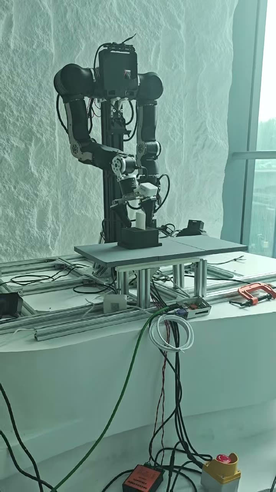
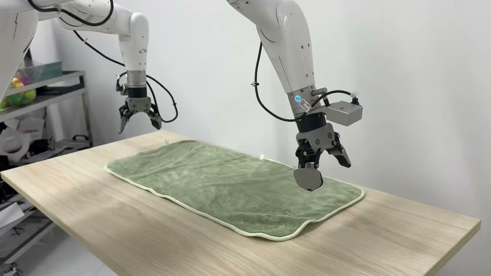
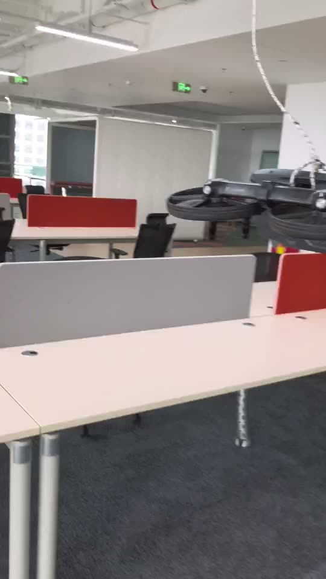
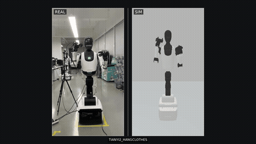
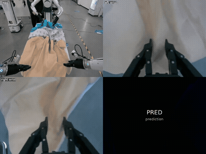
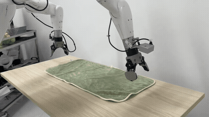
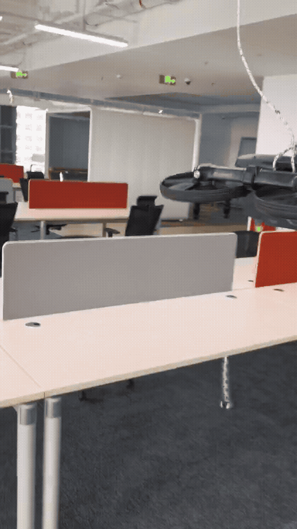

# 郭跃

**具身世界模型 / World-Action Model 算法方向**

哈尔滨工业大学（深圳）硕士 · 机器人与先进制造学院 · CAIA 实验室（导师：Bernd Noack）  
研究兴趣：World-Action Model、Video2World、VLA、Sim2Real / Real2Sim 数据闭环

📍 深圳 · 📧 [your-email@example.com] · 📱 [your-phone-number]  
[GitHub](https://github.com/guoyue0412) · [论文阅读](./content/papers/) · [实习记录](./content/internship/) · [秋招复盘](./content/jobs/) · [日常思考](./content/reflections/)

  
  
  

---

## 目录

- [关于我](#关于我)
- [精选项目](#精选项目-selected-work)
- [快速入口](#快速入口-fast-entry)
- [项目演示](#项目演示)
- [教育经历](#教育经历)
- [实习经历](#实习经历)
- [科研与项目经历](#科研与项目经历)
- [核心技能](#核心技能)
- [荣誉奖项](#荣誉奖项)
- [项目证据索引](#项目证据索引)
- [精选笔记](#精选笔记)

---

## 关于我

我关注的问题是：**如何让生成式世界模型成为可部署、可泛化的机器人策略**。  
硕士阶段围绕 **Cosmos-Predict2.5-2B、DiT4DiT、OpenPI π₀.₅** 开展 Video2World、future latent prediction、跨本体动作适配及真机部署，具备多源机器人数据统一、开源模型后训练与多机多卡训练实践。前沿跟踪：持续研读 **π 系列、DreamZero、EgoScale、EgoWAM**，关注 Flow Matching VLA、WAM 视频–动作建模与 Ego-to-Robot 对齐。

> 这个主页同时是我的简历、项目证据索引与阅读笔记入口。如果你是我的面试官或合作者，建议从下方的「快速入口」开始看。

### 近期动态 News

- **2026-08**：在北京人形机器人创新中心打通 Sim2Real / Real2Sim 双向动作数据闭环，两平台 8 个 case 运动复现，REAL|SIM 视频对时长误差 0.01s 级
- **2026-08**：重构个人主页，新增项目视频证据与 Fast Entry 索引
- **2026-04**：加入智源 BAAI 认知大模型组，实习方向为世界模型与机器人策略
- **2026-04**：完成道通智能 VLA 真机部署，动态抓取成功率 40% → 70%
- **2025-08**：获中国机器人及人工智能大赛国家级一等奖（复合机器人月球探索，全场最快成绩）
- **2024-02**：获中国大学生工程实践与创新能力大赛全国总决赛金奖（「智能+」赛道，组长）

---

## 精选项目 Selected Work

| | | |
|---|---|---|
|  |  |  |
| **Sim2Real / Real2Sim 数据闭环** 北京人形 · 两平台 8 case，0.01s 级对齐 | **WAM 多视角视频预测** BAAI · 多视角联合预测，head-camera frame 动作统一 | **OpenArms 双臂叠衣** BAAI · DiT4DiT 跨本体后训练，8D → 16D |
|  |  | |
| **VLA 真机操作落地** 道通 · 动态抓取成功率 40%+ → 70%+ | **BPTT 可微仿真与 Sim-to-Real** 道通 · 公司首个实践验证 RL 控制器，10 万元奖金 | |

> 完整项目列表见下方「快速入口」，演示视频见「[项目演示](#项目演示)」。

---

## 快速入口 Fast Entry

| 项目 | 关键词 | 我做了什么 | 关键结果 | 证据 |
|---|---|---|---|---|
| **北京人形 · Sim2Real/Real2Sim 数据闭环** | Sim2Real, Real2Sim, 数据工厂 | 打通仿真↔真机双向动作闭环：统一关节语义与时间轴，真机成功动作回灌仿真生成帧级对齐的 REAL\|SIM 视频对 | 天轶2.0+Robotiq 与松灵双臂两平台 **8 个 case** 运动复现，视频时长误差 **0.01s 级** | 见下方「项目演示」/ `clean_2026/02-internship/humanoid-sim2real/` |
| **BAAI · WAM 预训练** | Cosmos-Predict2.5-2B, PolicyDiT, ActionExpert | 搭建 Video2World → PolicyDiT → ActionExpert 三阶段 WAM；统一 DROID/EgoDex/AgiBot/RoboTwin 动作空间到 head-camera frame | 策略路径无需完整视频去噪，单次前向解码 30-step action chunk | 见下方「项目演示」/ `clean_2026/02-internship/baai-wam/`（多视角预测视频） |
| **BAAI · DiT4DiT / OpenArms** | DiT4DiT, LeRobot v3, 跨本体 | 冻结 DiT backbone，新增 embodiment 适配层，完成 LIBERO 8D → OpenArms 16D 动作迁移与双臂叠衣后训练 | 多视角预测与双臂协调动作序列生成 | 见下方「项目演示」/ `clean_2026/02-internship/baai-dit4dit/` |
| **道通 · VLA 真机落地** | OpenPI π₀.₅, 智元 G1, ROS2 | 负责数据清洗 → 8 卡 A800 全量微调 → ROS2 端云部署的完整闭环 | 动态抓取成功率 **40%+ → 70%+**；LIBERO-10 平均 **96.6%** | 见下方「项目演示」/ `clean_2026/02-internship/daotong-vla/` |
| **道通 · BPTT 可微仿真** | JAX, BPTT, Sim-to-Real | 构建 JAX 可微动力学引擎与残差模型，建立 1h 内多轮调参验证体系 | 公司首个实践验证的 RL 控制器，**获 10 万元项目奖金** | 见下方「项目演示」/ `clean_2026/02-internship/daotong-bptt/` |
| **道通 · 残差动力学管线** | PyTorch, Transformer, WebDataset | 设计 Transformer 动力学与残差双头预测，重构数据管线 | 平移动力学预测精度 **提升 10 倍**；训练吞吐 **提升 1000%** | `clean_2026/02-internship/daotong-residual/`（slides PDF + 轨迹跟踪曲线图） |
| **道通 · LIFT 人形控制** | MuJoCo Playground, World Model, Fine-tuning | 参与人形机器人高效微调预研：探索与执行解耦，真实环境只执行确定性动作，随机探索在世界模型内部 rollout | 单张 RTX 4090 可完成部署级预训练；Go1 仅需 80–590 s 真实数据即显著改善姿态与步态 | `clean_2026/06-resume/自我介绍ppt_京东.pdf`（slides） |
| **道通 · Extreme Parkour** | Isaac Lab, Teacher-Student, Curriculum Learning | 参与四足极限跑酷预研：Teacher 策略利用特权信息，Student 通过视觉蒸馏部署到端侧；课程学习动态生成渐进式地形 | 支持 Unitree Go1/Go2，端侧仅依赖深度相机 + IMU | `clean_2026/06-resume/自我介绍ppt_京东.pdf`（slides） |
| **道通 · AutoResearch** | LLM Agent, Auto-tuning, 强化学习 | 搭建自动化强化学习调参平台：LLM Agent 自动生成训练配置、调用接口、反馈效果 | 调参效率 **提升 2.6 倍**，支持 24h 连续实验 | `clean_2026/02-internship/daotong-autoresearch/`（slides PDF + 平台 Dashboard 截图） |
| **Colugo** | VLA, Multi-Scale Latent World Model | 参与 slow/fast future 建模与 flow-based Action DiT 调制；完成多平台消融 | LIBERO-Long / CALVIN ABC→D / AgileX Nero 消融评测 | `clean_2026/03-research/colugo/` |

> **边界说明**：WAM、Colugo、LIFT、Extreme Parkour、AutoResearch 为团队共建或预研项目；北京人形 Sim2Real/Real2Sim、道通 VLA/BPTT/残差动力学、BAAI DiT4DiT 中我主导了从算法到落地的完整链路或关键子模块。

---

## 项目演示

> 主页只展示 4 段代表作（GIF 自动播放，点击任意动图进入完整画廊）。**全部 21 段演示见 [完整画廊 →](https://github.com/guoyue0412/reading-journal-sites/blob/main/projects.md)**。

  
  
  
  

*北京人形 Sim2Real 闭环 · BAAI WAM 多视角预测 · 道通 VLA 真机 · 道通 BPTT 可微仿真*

---

## 教育经历

| 时间 | 学校 | 学院 | 学位 / 专业 | GPA |
|---|---|---|---|---|
| 2024.08 – 2027.06（预计） | 哈尔滨工业大学（深圳） | 机器人与先进制造学院 | 硕士 · 动力工程（保研，专业学位） | 3.639 / 4.0（前 5%） |
| 2020.09 – 2024.06 | 吉林大学 | 汽车工程学院 | 本科 · 动力工程（已保研） | 3.826 / 4.0（前 5%） |

> 硕士实验室 / 导师：CAIA / Bernd Noack。

---

## 实习经历

### 北京人形机器人创新中心
**具身智能算法实习生 · 2026.08 – 至今**

<strong>Sim2Real / Real2Sim 动作数据闭环</strong>（Isaac Sim, LeRobot, 轨迹复播）

- **Sim2Real**：Sim 端生成任务动作、关节轨迹与参考视频，输出标准轨迹包（时间戳、关节名称与顺序、单位、夹爪映射、校验信息）；Real 端完成离线校验、频率转换、安全预定位与真机复播，保存执行日志与真机视频，形成可追溯结果。
- **Real2Sim**：Real 端从遥操数据或真机成功复播日志导出标准轨迹包；Sim 端按首帧直接初始化、固定频率逐点回放（不重新规划 / IK），重新渲染 Sim 视频并对真机视频做帧级裁剪与时间对齐。
- 两条链路共用同一套动作语义，解决语义一致（关节名称/顺序/方向/单位/夹爪映射）、时序一致（原始时间轴、重采样、帧级对齐）、行为一致（机械臂与夹爪同步复现）、结果可追溯（轨迹、元数据、初始状态、日志、数据指纹可关联）四个核心问题。
- **已在天轶 2.0 + Robotiq 与松灵双臂两平台完成 8 个 case 的运动复现，生成 REAL | SIM 视频对时长误差 0.01s 级**；真机侧已验证可完成抓取。
- 下一阶段：场景精准重建（3DGS → USD → Isaac Sim）、分层 Metrics 质量门禁（运动/时序/任务/视觉四层）、批量数据工厂，目标是从 LeRobot 数据集批量 1:1 复现 Sim 视频，产出可用于训练的高质量 Sim-Real Pair 数据集。

### 智源人工智能研究院（BAAI）· 认知大模型组
**世界模型与机器人策略算法实习生 · 2026.04 – 2026.08**

参与 World-Action Model 预训练与跨本体后训练，核心课题是让视频生成模型作为策略教师，同时避免策略路径承担完整的多步视频去噪开销。

<strong>Head Camera-Frame WAM 训练栈</strong>（Cosmos-Predict2.5-2B, PolicyDiT, ActionExpert, DeepSpeed）

- 搭建 Video2World 2B DiT → PolicyDiT → ActionExpert/ActionDecoderDiT 三阶段 WAM；以 Cosmos-Predict2.5-2B 为教师，在固定低噪声时刻对齐 condition-frame hidden states，聚合 future-aware 表征。
- PolicyDiT 单次前向预测，ActionExpert 解码 30-step action chunk（2 s），策略路径无需完整多步去噪，缓解 train-inference 输入不一致。
- 将 DROID、EgoDex、AgiBot、RoboTwin 动作空间统一变换到 head-camera frame，以带 action_mask/confidence 的 48D EE pose delta 兼容异构本体；先完成 DROID 单源验证，再扩展至多源异构训练。
- 多视角视频 latent 沿 width 维拼接联合预测，注入 FPS 条件与 3D RoPE，统一不同采样率下的时间尺度与空间位置编码。

<strong>OpenArms 双臂叠衣跨本体后训练</strong>（DiT4DiT, LeRobot v3.0）

- 冻结 DiT backbone，新增 OpenArms embodiment 适配层，将 LIBERO 8D 单臂动作空间迁移到 OpenArms 16D 双臂动作序列。
- 接入 LeRobot v3 多视角 RGB、本体状态与语言指令，完成双臂叠衣任务的跨本体后训练与协调动作序列生成。

### 深圳市道通智能航空技术股份有限公司
**强化学习算法工程师 · 前沿预研 · 2025.11 – 2026.04**

<strong>VLA 真机具身操作落地预研</strong>（智元 G1 + OpenPI π₀.₅，OpenPI / ROS2 / LeRobot/OXE）

- 基于 8 卡 A800 全量微调 OpenPI π₀.₅ Flow Matching VLA（batch size 256，训练 30k 步约 12 小时，warmup + constant 学习率）；完成 VR 遥操轨迹清洗、quantile normalization 与 LeRobot/OXE 格式转换；单任务约采集 60 条示教轨迹，失败样本补录 20 条。
- 完成 224×224 图像输入、Action Chunk 下发及 ROS2 端云推理；Policy Server（A100）与 G1 客户端通过 Socket 低延迟通信，服务端可热更新模型无需停机。
- **智元 G1 动态抓取成功率由 40%+ 提升至 70%+**；推理端 policy infer 延迟约 75 ms。
- 完成 LIBERO 仿真评测链路适配：LIBERO-10 平均成功率 **96.6%**；LIBERO-90 共 74 个任务，其中 40 个任务获得可复现成功 rollout。

<strong>高动态 BPTT 可微仿真与 Sim-to-Real</strong>（JAX, BPTT, TensorRT）

- 第一版方案基于 Transformer 对 HIL 数据做动力学预测，但实验噪声与迭代周期问题导致效果受限；随后切换至可微仿真 + BPTT 方向。
- 第二版参考 NeuroBEM 混合空气动力学模型与《Learning Quadrotor Control From Visual Features Using Differentiable Simulation》，构建 JAX 可微动力学引擎与二阶阻力模型，将未来多步飞行展开为长计算图，从最终轨迹误差反向传播更新控制器。
- 使用 Surrogate Gradients 缓解长时域梯度发散；以 Transformer 残差模型补偿域随机化未覆盖的仿真-实飞动力学差异。
- 训练 200–1000 轮获得可控控制器，约 2000 轮达到较小轨迹跟踪误差，建立 1h 内多轮调参验证体系；**获 10 万元项目奖金**。

<strong>残差动力学模型与高吞吐数据管线</strong>（PyTorch, Transformer, WebDataset）

- 构建 Transformer 动力学与残差双头预测，结合可微物理链式求导隐式监督和残差置信度建模，**平移动力学预测精度提升 10 倍，残差误差降至 < 5%**。
- 以轨迹池预生成、WebDataset 块级打散和自动课程学习替代 DataLoader，**训练吞吐提升 1000%**。

<strong>LIFT：人形机器人大规模预训练与高效微调</strong>（MuJoCo Playground, World Model, Fine-tuning）

- 核心思路是**探索与执行解耦**：真实机器人只执行策略的确定性动作，真正的随机探索在世界模型内部 rollout 完成，避免硬件损伤。
- 三阶段框架：① 在 MuJoCo Playground 中进行大规模并行仿真预训练，训练强基础策略；② 利用离线数据训练 physics-informed world model，补偿未建模动态；③ 真实环境提供真实分布数据，世界模型提供廉价探索与额外训练样本，策略与世界模型共同迭代。
- **单张 RTX 4090 即可完成可部署的人形预训练；Go1 仅需 80–590 秒真实数据即可显著改善姿态与步态**。

<strong>Extreme Parkour：四足机器人极限跑酷</strong>（Isaac Lab, Teacher-Student, Curriculum Learning）

- 采用 Teacher-Student 两阶段框架：Teacher 策略利用特权信息（地形高度图、物理参数）在仿真中训练；Student 策略通过视觉蒸馏，仅依赖机载深度相机与 IMU 实现端侧部署。
- 引入课程学习机制，动态生成从平地到高台、间隙、斜坡的渐进式地形，机器人根据当前表现自动调整难度。
- 基于 Isaac Lab 进行大规模并行训练；Teacher 通过 132 条射线高度扫描获取局部地形，Student 通过 GRU 时序融合提取 32 维地形向量；RMA 架构编码历史本体状态增强鲁棒性。
- 原生支持 Unitree Go1 / Go2 等主流四足平台。

<strong>AutoResearch：自动化强化学习调参平台</strong>（LLM Agent, Auto-tuning）

- 搭建 LLM Agent 驱动的自动迭代平台：用户设定目标后，Agent 自动生成训练配置、调用训练接口、解析效果反馈并给出候选超参。
- Transformer 智能体基于 scaling law 选择 layers / hidden dimension / multi-head，自动调学习率、batch size、warmup 与微调方式；强化学习控制智能体自动调 reward 权重、惩罚项与学习率，并约束动作平滑性。
- **调参效率提升 2.6 倍**，支持 24h 连续实验；以 JSON 结构化反馈沉淀专家经验。

---

## 科研与项目经历

### Colugo：多尺度潜在世界模型引导的 VLA 机器人操作研究
**协作研究 · 2026**

- 参与 Multi-Scale Latent World Modeling：以 learnable slow/fast queries 从 VLM hidden states 预测 latent futures，通过 dual cross-attention + MLP fusion 调制 flow-based Action DiT。
- 训练采用 sparse slow-future targets 与 dense future reconstruction，推理阶段移除 reconstruction decoder。
- 在 LIBERO-Long、CALVIN ABC→D 及 AgileX Nero + RealSense D455 上完成 no future / slow only / fast only / slow+fast 消融评测。

### 复合机器人月球探索
**项目负责人 · 2025.05 – 2025.07**

- 负责全向底盘 + 5-DOF 机械臂系统研发，融合 RGB-D / LiDAR / IMU 实现自主建图、动态避障与目标夹取。
- 获中国机器人及人工智能大赛**国家级一等奖**及**全场最快成绩**。

### 无人机抗风性能优化及底层控制
**项目负责人 · 2024.10 – 2025.08**

- 构建 DNN/CNN 气动代理、PPO 调参智能体与 C++ 模糊 PID，将扰动下轨迹追踪误差**降低 76.6%**。
- 项目获评优秀开题。

---

## 核心技能

| 方向 | 具体内容 |
|---|---|
| 视频生成/预测与策略建模 | Video2World、Diffusion / Flow Matching、VLA、future latent / latent dynamics、跨本体动作空间适配 |
| 训练与数据工程 | PyTorch、JAX、DeepSpeed、多机多卡与 bf16 混合精度；WebDataset、LeRobot/OXE、多源机器人数据统一与加权采样 |
| 评测与部署 | LIBERO / CALVIN 消融评测、JAX BPTT 与 Sim-to-Real；ROS2 端云推理、TensorRT/ONNX 部署 |
| 语言 | 英语 CET-4 545 / CET-6 464 |

---

## 荣誉奖项

- 国家奖学金（2 / 145）
- 黑龙江省优秀学生
- 哈尔滨工业大学（深圳）特等学业奖学金
- 中国大学生工程实践与创新能力大赛「智能+」赛道全国总决赛**金奖**（组长）
- 中国机器人及人工智能大赛**国家一等奖**（全场最快成绩）
- 第十三届全国大学生数学竞赛**二等奖**
- 第十四届周培源大学生力学竞赛**全国优秀奖**
- 2024 届吉林大学优秀毕业生
- 黎明人才奖学金 × 3（10 / 455）
- 苏州育才奖学金
- 吉林大学汽车工程学院十佳大学生

> 以上为节选；完整 29 项荣誉清单见本地 `clean_2026/06-resume/` 中的 PlayOffer 简历源文件。

---

## 项目证据索引

> 本地完整证据库位于 `/Users/guoyue/gy_2026/clean_2026/`；部分精选视频已放入本仓库 `assets/evidence/`，可在 GitHub 直接播放。完整索引与缺失清单见 `clean_2026/evidence-index.md`。

| 简历条目 | 本仓库视频 | 完整证据目录 |
|---|---|---|
| 北京人形 · Sim2Real/Real2Sim 数据闭环 | `assets/evidence/humanoid-sim2real/`（6 段） | `clean_2026/02-internship/humanoid-sim2real/` |
| BAAI · WAM 多视角预测 | `assets/evidence/baai-wam/`（4 段） | `clean_2026/02-internship/baai-wam/` |
| BAAI · OpenArms 双臂叠衣 | `assets/evidence/baai-dit4dit/`（3 段） | `clean_2026/02-internship/baai-dit4dit/` |
| 道通 · VLA 真机操作 | `assets/evidence/daotong-vla/`（5 段） | `clean_2026/02-internship/daotong-vla/` |
| 道通 · BPTT 可微仿真 | `assets/evidence/daotong-bptt/`（3 段） | `clean_2026/02-internship/daotong-bptt/` |
| 道通 · 残差动力学管线 | — | `clean_2026/02-internship/daotong-residual/`（slides PDF + 轨迹跟踪曲线图 ×3） |
| 道通 · AutoResearch | — | `clean_2026/02-internship/daotong-autoresearch/`（slides PDF + 架构/Dashboard 截图 ×2） |
| 道通 · LIFT / Parkour | — | `clean_2026/06-resume/自我介绍ppt_京东.pdf`（slides） |
| 人形机器人 | `assets/evidence/humanoid/third_view.mp4` | `clean_2026/04-projects/humanoid/` |
| 科研 · Colugo | — | `clean_2026/03-research/colugo/` |
| 奖项 · 黑龙江省优秀学生 | — | `clean_2026/05-awards/` |
| 各版本简历 | — | `clean_2026/06-resume/` |

**缺失待补**：道通残差动力学吞吐对比视频（训练/误差曲线图已有）、LIFT/Parkour/AutoResearch 独立演示视频（slides 与截图已有）、复合机器人月球探索比赛视频/证书、无人机抗风飞行 demo、多数奖项高清证书扫描件。

---

## 精选笔记

> 从 `content/` 目录中挑选的几篇记录。

- [UniTacVLA：触觉如何进入动作生成](./content/papers/unitacvla-reading.md) —— 从动作条件化视角理解视觉、语言与触觉如何共同影响策略输出。
- [实习第 47 天：第一次把一个模型真正跑进业务](./content/internship/day-47-model-in-production.md) —— 离线指标之外，模型进入真实业务链路时学到的事。
- [秋招不是一场考试，而是一段重新认识自己的旅程](./content/jobs/autumn-recruiting-journey.md) —— 投递、面试与选择背后的思考。

## 内容目录

- **论文阅读** → [`content/papers/`](./content/papers/)
- **秋招记录** → [`content/jobs/`](./content/jobs/)
- **实习日记** → [`content/internship/`](./content/internship/)
- **个人感悟** → [`content/reflections/`](./content/reflections/)

---

*最后更新：2026-08-26 · 联系邮箱与电话已用占位符代替，如需获取请通过 GitHub 私信或校方邮箱联系。*
