# 项目演示（完整画廊）

> 主页只展示代表作，本页收录全部演示。GIF 自动播放，**点击任意 GIF 可播放完整视频**（mp4）。  
> 返回 [主页](./README.md) · 完整证据库（含未放入仓库的大文件）见本地 `clean_2026/`。

---

## 北京人形 · Sim2Real / Real2Sim 动作数据闭环

天轶2.0+Robotiq 与松灵双臂两平台 8 个 case 运动复现，REAL | SIM 视频对时长误差 0.01s 级。

  
  <a href="./assets/evidence/humanoid-sim2real/tianyi_right_REAL_SIM.mp4">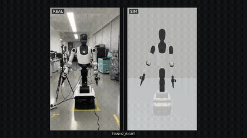</a>

*天轶 2.0 + Robotiq：REAL | SIM 帧级对齐视频对（挂衣服 / 右臂动作）*

  <a href="./assets/evidence/humanoid-sim2real/blue_REAL_SIM.mp4">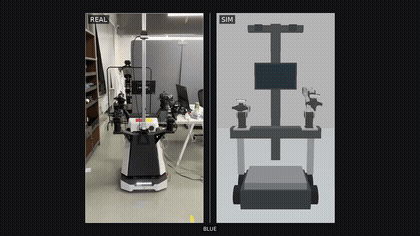</a>
  <a href="./assets/evidence/humanoid-sim2real/purple_REAL_SIM.mp4">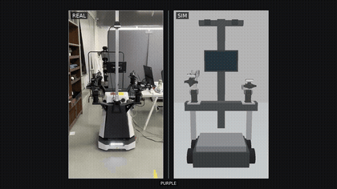</a>
  <a href="./assets/evidence/humanoid-sim2real/tray_REAL_SIM.mp4">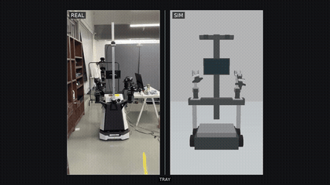</a>

*松灵双臂：REAL | SIM 视频对（BLUE / PURPLE / TRAY 三个 case）*

---

## BAAI · WAM 多视角视频预测

  <a href="./assets/evidence/baai-wam/wam_episode_gopro_view.mp4">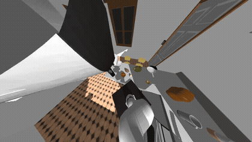</a>
  <a href="./assets/evidence/baai-wam/wam_episode_zed2_view.mp4">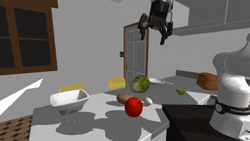</a>
  <a href="./assets/evidence/baai-wam/wam_episode_shoulder_view.mp4">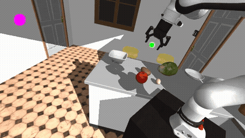</a>

*同一 episode 三视角联合预测（DROID，gopro / zed2 / shoulder，域随机化）*

<a href="./assets/evidence/baai-wam/wam_teacher_posttrain_gt_pred.mp4">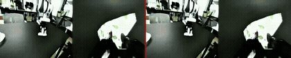</a>

*教师模型后训练效果：GT vs 预测对比*

---

## BAAI · OpenArms 双臂叠衣与多视角预测

<a href="./assets/evidence/baai-dit4dit/openarm_demo.mp4">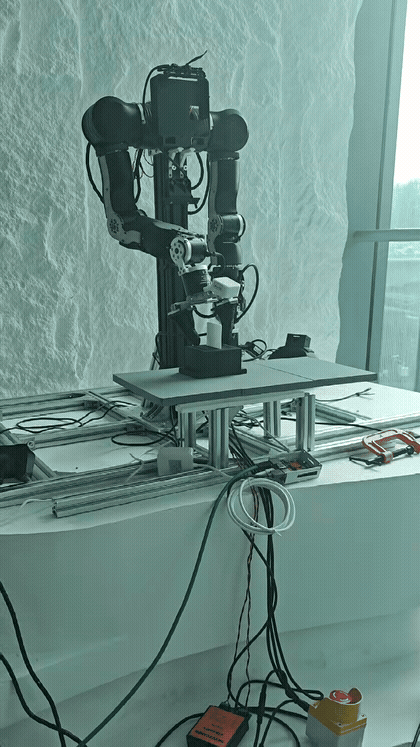</a>

*OpenArms 双臂叠衣 demo*

<a href="./assets/evidence/baai-dit4dit/agibot_multiview_pred.mp4">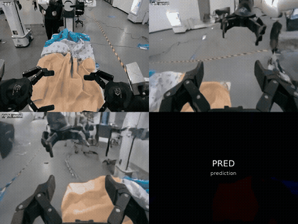</a>

*AgiBot 多视角视频预测*

<a href="./assets/evidence/baai-dit4dit/robotwin_multiview_pred.mp4">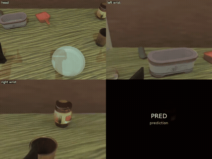</a>

*RoboTwin 多视角视频预测*

---

## 道通 · VLA 真机操作（智元 G1 + OpenPI π₀.₅）

*真机 VLA 测试（动态抓取成功率 40%+ → 70%+，policy infer 延迟约 75 ms）*

<a href="./assets/evidence/daotong-vla/vr_teleop_1.mp4">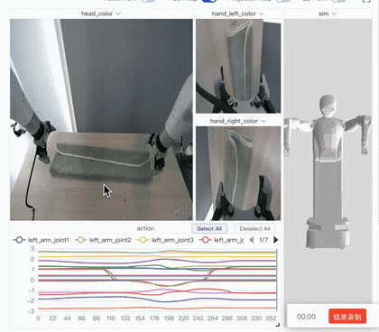</a>

*VR 遥操作数据采集*

  <a href="./assets/evidence/daotong-vla/libero10_task00.mp4">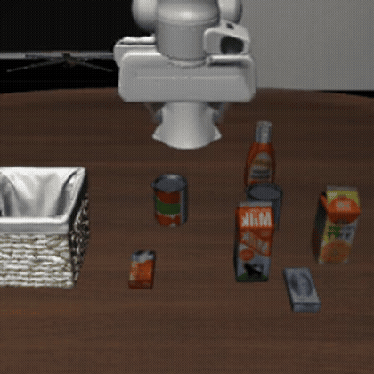</a>
  <a href="./assets/evidence/daotong-vla/libero10_task02.mp4">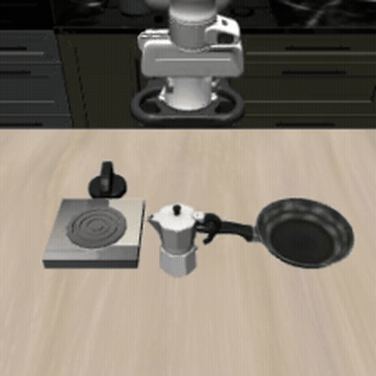</a>
  <a href="./assets/evidence/daotong-vla/libero10_task06.mp4">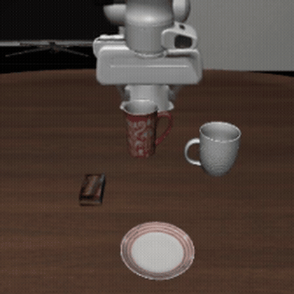</a>

*LIBERO-10 仿真评测示例（平均成功率 96.6%）*

---

## 道通 · BPTT 可微仿真与 Sim-to-Real

*变形飞车迁移效果*

<a href="./assets/evidence/daotong-bptt/极限.mp4">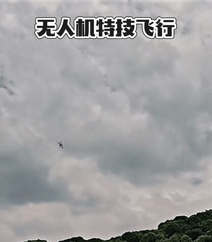</a>

*极限工况测试*

<a href="./assets/evidence/daotong-bptt/炸机.mp4">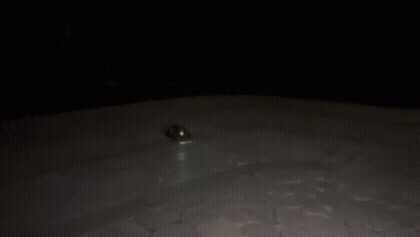</a>

*失败案例分析（炸机）*

---

## 人形机器人

<a href="./assets/evidence/humanoid/third_view.mp4">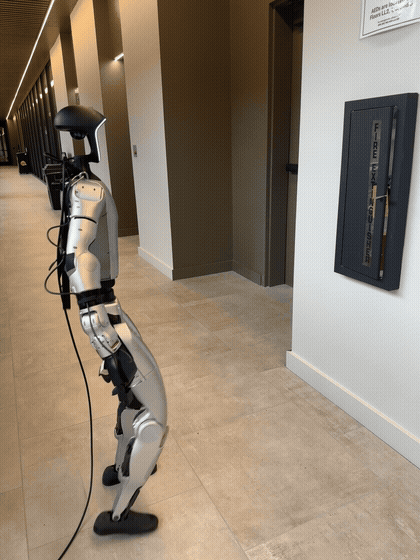</a>

*人形机器人第三视角*
